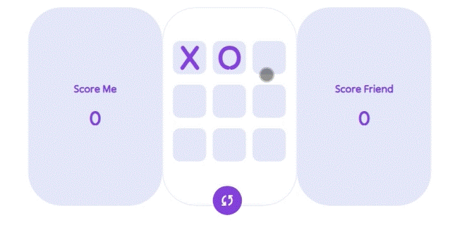
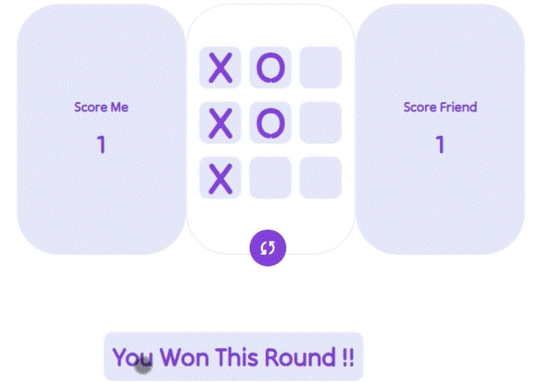
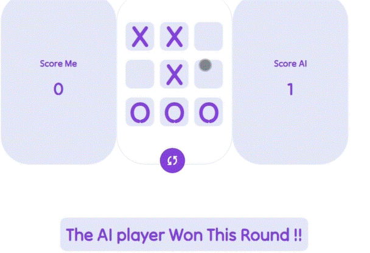
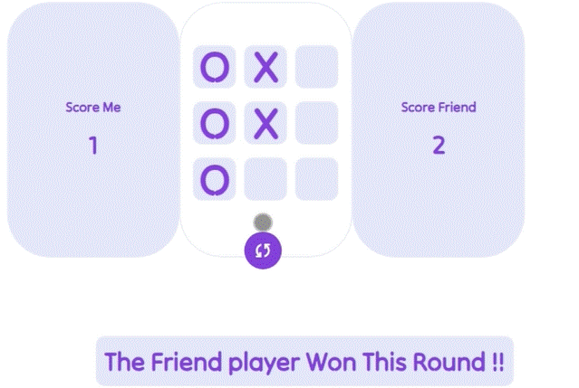
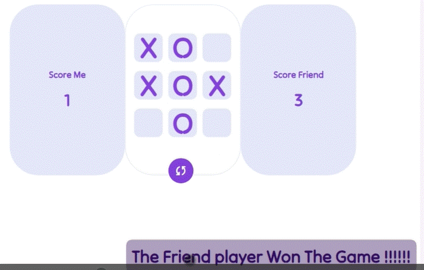
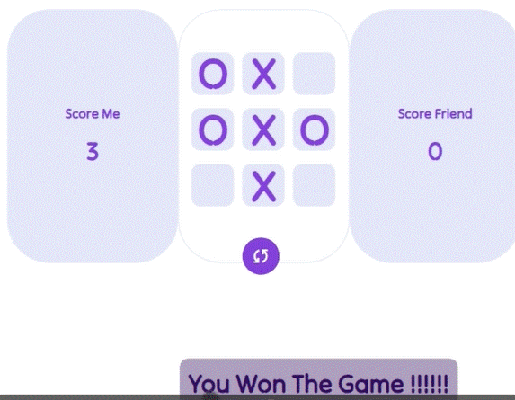
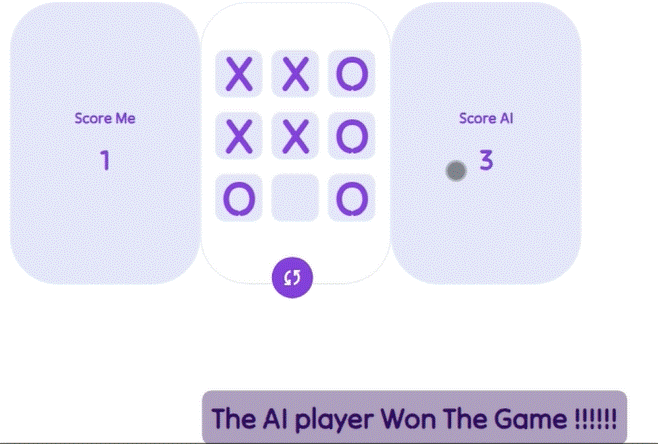

# tic-tac-toe-JS
A classic Tic-Tac-Toe game implemented in JavaScript. This project provides a simple , responsive and interactive user interface to play the timeless game of Tic-Tac-Toe against a friend or an AI opponent.


## Technologies Used

JavaScript: Core game logic and user interaction.
HTML/CSS: Frontend design and layout.
Bootstrap: Responsive design and UI components.


## Getting Started
```
git clone https://github.com/ThexOnex/tic-tac-toe-JS.git
cd Tic-Tac-Toe
```
Then open index.html in your preferred web browser.















